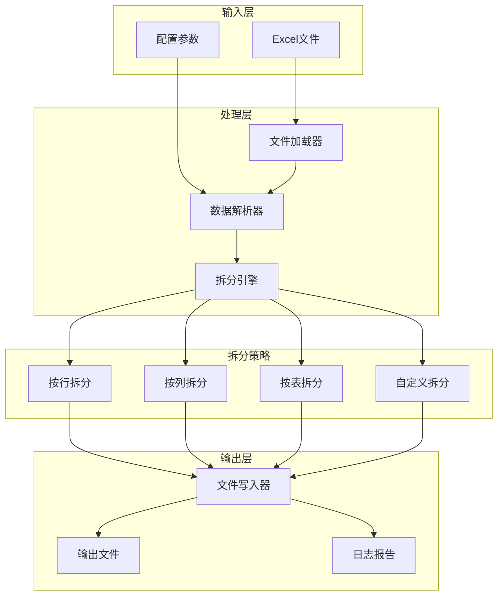

# 🐍 test-pythonSplitExcel - Excel文件拆分工具


## 📖 项目简介

test-pythonSplitExcel是一个Excel文件拆分工具,支持按行数、按列值、按工作表等多种方式拆分Excel文件,提高数据处理效率。

## 🏗️ 系统架构



## 🚀 快速开始

### 环境要求

- Python 3.8+
- pip

### 安装步骤

```bash
# 1. 克隆项目
git clone https://github.com/yourusername/test-pythonSplitExcel.git

# 2. 进入项目目录
cd test-pythonSplitExcel

# 3. 安装依赖
pip install -r requirements.txt

# 4. 运行示例
python main.py --input data.xlsx --rows 1000
```

## 🛠️ 技术栈

| 技术 | 版本 | 说明 |
|------|------|------|
| Python | 3.8+ | 编程语言 |
| Pandas | 2.x | 数据处理库 |
| OpenPyXL | 3.x | Excel操作库 |
| xlrd | 2.x | Excel读取库 |

## 📁 项目结构

```
test-pythonSplitExcel/
├── src/
│   ├── __init__.py
│   ├── file_loader.py          # 文件加载器
│   ├── data_parser.py          # 数据解析器
│   ├── split_engine.py         # 拆分引擎
│   ├── strategies/             # 拆分策略
│   │   ├── row_split.py        # 按行拆分
│   │   ├── column_split.py     # 按列拆分
│   │   ├── sheet_split.py      # 按表拆分
│   │   └── custom_split.py     # 自定义拆分
│   └── file_writer.py          # 文件写入器
├── tests/                      # 测试代码
│   ├── test_row_split.py
│   ├── test_column_split.py
│   └── test_sheet_split.py
├── examples/                   # 示例文件
│   ├── sample_data.xlsx
│   └── config.json
├── requirements.txt            # 依赖配置
├── main.py                     # 主程序入口
└── README.md                   # 项目说明
```

## 💡 核心示例

### 按行数拆分

```python
import pandas as pd
from typing import List

class RowSplitter:
    """按行数拆分Excel文件"""
    
    def __init__(self, file_path: str):
        self.file_path = file_path
        
    def split_by_rows(self, rows_per_file: int, output_dir: str) -> List[str]:
        """
        按指定行数拆分Excel文件
        
        Args:
            rows_per_file: 每个文件的行数
            output_dir: 输出目录
            
        Returns:
            生成的文件列表
        """
        # 读取Excel文件
        df = pd.read_excel(self.file_path)
        
        # 计算总行数和需要拆分的文件数
        total_rows = len(df)
        num_files = (total_rows + rows_per_file - 1) // rows_per_file
        
        output_files = []
        
        # 拆分并保存
        for i in range(num_files):
            start_idx = i * rows_per_file
            end_idx = min((i + 1) * rows_per_file, total_rows)
            
            # 获取子数据集
            sub_df = df.iloc[start_idx:end_idx]
            
            # 保存到新文件
            output_file = f"{output_dir}/split_{i+1}.xlsx"
            sub_df.to_excel(output_file, index=False)
            
            output_files.append(output_file)
            print(f"生成文件: {output_file} (行数: {len(sub_df)})")
        
        return output_files

# 使用示例
if __name__ == "__main__":
    splitter = RowSplitter("data.xlsx")
    files = splitter.split_by_rows(rows_per_file=1000, output_dir="./output")
    print(f"共生成 {len(files)} 个文件")
```

### 按列值拆分

```python
import pandas as pd
from typing import List, Dict

class ColumnSplitter:
    """按列值拆分Excel文件"""
    
    def __init__(self, file_path: str):
        self.file_path = file_path
        
    def split_by_column(self, column_name: str, output_dir: str) -> Dict[str, str]:
        """
        按指定列的值拆分Excel文件
        
        Args:
            column_name: 列名
            output_dir: 输出目录
            
        Returns:
            生成的文件字典 {列值: 文件路径}
        """
        # 读取Excel文件
        df = pd.read_excel(self.file_path)
        
        # 按列值分组
        grouped = df.groupby(column_name)
        
        output_files = {}
        
        # 保存每个分组到独立文件
        for value, group in grouped:
            output_file = f"{output_dir}/{column_name}_{value}.xlsx"
            group.to_excel(output_file, index=False)
            
            output_files[value] = output_file
            print(f"生成文件: {output_file} (行数: {len(group)})")
        
        return output_files

# 使用示例
if __name__ == "__main__":
    splitter = ColumnSplitter("sales_data.xlsx")
    files = splitter.split_by_column(column_name="region", output_dir="./output")
    print(f"共生成 {len(files)} 个文件")
```

### 按工作表拆分

```python
import openpyxl
from typing import List

class SheetSplitter:
    """按工作表拆分Excel文件"""
    
    def __init__(self, file_path: str):
        self.file_path = file_path
        
    def split_by_sheet(self, output_dir: str) -> List[str]:
        """
        将Excel文件中的每个工作表拆分为独立文件
        
        Args:
            output_dir: 输出目录
            
        Returns:
            生成的文件列表
        """
        # 打开Excel文件
        wb = openpyxl.load_workbook(self.file_path)
        
        output_files = []
        
        # 遍历所有工作表
        for sheet_name in wb.sheetnames:
            # 创建新工作簿
            new_wb = openpyxl.Workbook()
            new_ws = new_wb.active
            new_ws.title = sheet_name
            
            # 复制数据
            source_sheet = wb[sheet_name]
            for row in source_sheet.iter_rows():
                new_row = []
                for cell in row:
                    new_row.append(cell.value)
                new_ws.append(new_row)
            
            # 保存到新文件
            output_file = f"{output_dir}/{sheet_name}.xlsx"
            new_wb.save(output_file)
            
            output_files.append(output_file)
            print(f"生成文件: {output_file}")
        
        return output_files

# 使用示例
if __name__ == "__main__":
    splitter = SheetSplitter("multi_sheet_data.xlsx")
    files = splitter.split_by_sheet(output_dir="./output")
    print(f"共生成 {len(files)} 个文件")
```

### 自定义拆分

```python
import pandas as pd
from typing import List, Callable

class CustomSplitter:
    """自定义拆分Excel文件"""
    
    def __init__(self, file_path: str):
        self.file_path = file_path
        
    def split_by_condition(
        self, 
        condition: Callable[[pd.DataFrame], List[pd.DataFrame]],
        output_dir: str,
        file_names: List[str]
    ) -> List[str]:
        """
        根据自定义条件拆分Excel文件
        
        Args:
            condition: 拆分条件函数,返回拆分后的DataFrame列表
            output_dir: 输出目录
            file_names: 文件名列表
            
        Returns:
            生成的文件列表
        """
        # 读取Excel文件
        df = pd.read_excel(self.file_path)
        
        # 应用拆分条件
        sub_dataframes = condition(df)
        
        if len(sub_dataframes) != len(file_names):
            raise ValueError("拆分后的数据数量与文件名数量不匹配")
        
        output_files = []
        
        # 保存每个子数据集
        for sub_df, file_name in zip(sub_dataframes, file_names):
            output_file = f"{output_dir}/{file_name}.xlsx"
            sub_df.to_excel(output_file, index=False)
            
            output_files.append(output_file)
            print(f"生成文件: {output_file} (行数: {len(sub_df)})")
        
        return output_files

# 使用示例
if __name__ == "__main__":
    def custom_condition(df):
        """自定义拆分条件: 按季度拆分"""
        df['date'] = pd.to_datetime(df['date'])
        
        q1 = df[(df['date'].dt.month >= 1) & (df['date'].dt.month <= 3)]
        q2 = df[(df['date'].dt.month >= 4) & (df['date'].dt.month <= 6)]
        q3 = df[(df['date'].dt.month >= 7) & (df['date'].dt.month <= 9)]
        q4 = df[(df['date'].dt.month >= 10) & (df['date'].dt.month <= 12)]
        
        return [q1, q2, q3, q4]
    
    splitter = CustomSplitter("annual_data.xlsx")
    files = splitter.split_by_condition(
        condition=custom_condition,
        output_dir="./output",
        file_names=["Q1", "Q2", "Q3", "Q4"]
    )
    print(f"共生成 {len(files)} 个文件")
```

### 批量处理

```python
import os
from typing import List
from concurrent.futures import ThreadPoolExecutor

class BatchSplitter:
    """批量拆分Excel文件"""
    
    def __init__(self, input_dir: str, output_dir: str):
        self.input_dir = input_dir
        self.output_dir = output_dir
        
    def batch_split(self, split_type: str = "row", **kwargs) -> List[str]:
        """
        批量拆分目录下的所有Excel文件
        
        Args:
            split_type: 拆分类型 (row/column/sheet)
            **kwargs: 拆分参数
            
        Returns:
            生成的文件列表
        """
        # 获取所有Excel文件
        excel_files = [
            f for f in os.listdir(self.input_dir) 
            if f.endswith(('.xlsx', '.xls'))
        ]
        
        all_output_files = []
        
        # 并发处理
        with ThreadPoolExecutor(max_workers=4) as executor:
            futures = []
            
            for file in excel_files:
                file_path = os.path.join(self.input_dir, file)
                file_output_dir = os.path.join(self.output_dir, os.path.splitext(file)[0])
                
                os.makedirs(file_output_dir, exist_ok=True)
                
                if split_type == "row":
                    splitter = RowSplitter(file_path)
                    future = executor.submit(
                        splitter.split_by_rows, 
                        kwargs.get('rows_per_file', 1000),
                        file_output_dir
                    )
                elif split_type == "column":
                    splitter = ColumnSplitter(file_path)
                    future = executor.submit(
                        splitter.split_by_column,
                        kwargs.get('column_name'),
                        file_output_dir
                    )
                
                futures.append(future)
            
            # 收集结果
            for future in futures:
                output_files = future.result()
                all_output_files.extend(output_files)
        
        return all_output_files

# 使用示例
if __name__ == "__main__":
    batch_splitter = BatchSplitter("./input", "./output")
    files = batch_splitter.batch_split(split_type="row", rows_per_file=500)
    print(f"共生成 {len(files)} 个文件")
```

### 命令行工具

```python
import argparse
from pathlib import Path

def main():
    parser = argparse.ArgumentParser(description="Excel文件拆分工具")
    
    parser.add_argument("--input", "-i", required=True, help="输入Excel文件路径")
    parser.add_argument("--output", "-o", default="./output", help="输出目录")
    parser.add_argument("--type", "-t", 
                       choices=["row", "column", "sheet"], 
                       default="row",
                       help="拆分类型")
    parser.add_argument("--rows", "-r", type=int, default=1000, 
                       help="按行拆分时,每个文件的行数")
    parser.add_argument("--column", "-c", help="按列拆分时的列名")
    
    args = parser.parse_args()
    
    # 创建输出目录
    Path(args.output).mkdir(parents=True, exist_ok=True)
    
    # 根据类型拆分
    if args.type == "row":
        splitter = RowSplitter(args.input)
        files = splitter.split_by_rows(args.rows, args.output)
    elif args.type == "column":
        if not args.column:
            print("错误: 按列拆分需要指定列名 (--column)")
            return
        splitter = ColumnSplitter(args.input)
        files = splitter.split_by_column(args.column, args.output)
    elif args.type == "sheet":
        splitter = SheetSplitter(args.input)
        files = splitter.split_by_sheet(args.output)
    
    print(f"\n拆分完成! 共生成 {len(files)} 个文件")

if __name__ == "__main__":
    main()
```

## 📊 使用示例

### 基础使用

```bash
# 按行拆分(每1000行一个文件)
python main.py --input data.xlsx --type row --rows 1000

# 按列拆分(按地区列拆分)
python main.py --input data.xlsx --type column --column region

# 按工作表拆分
python main.py --input data.xlsx --type sheet
```

### 高级用法

```bash
# 批量拆分目录下的所有Excel文件
python batch_split.py --input ./input --output ./output --type row --rows 500

# 指定输出格式
python main.py --input data.xlsx --type row --rows 1000 --format csv
```

## 🎯 核心特性

- **多种拆分方式**: 支持按行、按列、按工作表拆分
- **批量处理**: 支持批量拆分多个Excel文件
- **自定义规则**: 支持自定义拆分条件
- **并发处理**: 多线程提升处理速度
- **格式支持**: 支持xlsx、xls、csv等格式
- **命令行工具**: 提供便捷的命令行接口

## 📝 更新日志

### v1.0.0 (2024-01-01)
- ✨ 初始版本发布
- ✨ 实现按行拆分功能
- ✨ 实现按列拆分功能
- ✨ 实现按工作表拆分功能
- ✨ 实现批量处理功能

## 👥 贡献指南

欢迎贡献代码!请遵循以下步骤:

1. Fork本仓库
2. 创建特性分支 (`git checkout -b feature/AmazingFeature`)
3. 提交更改 (`git commit -m 'Add some AmazingFeature'`)
4. 推送到分支 (`git push origin feature/AmazingFeature`)
5. 提交Pull Request

## 📄 许可证

本项目采用 MIT 许可证 - 查看 [LICENSE](LICENSE) 文件了解详情

## 📮 联系方式

项目维护者: JOSP Team

---

⭐ 如果这个项目对你有帮助,欢迎Star支持!
